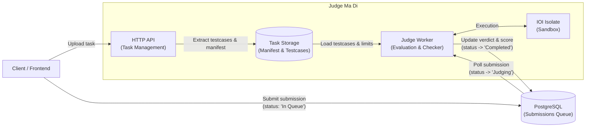

# Programming Judge System

Judge Ma Di (จัดมาดิ๊)

# Stack

- Rust
- Axum (Rust API Framework)
- IOI Isolate (Sandbox Environment)
- PostgreSQL (Database)

# Architecture



# [:link:Setup (with frontend)](https://gist.github.com/chawinkn/f1c7dae8bc4b0b8f489d0f775c715bcd)

- Docker (Containerization)

## With Docker

Setup the services environment or other settings in `compose.yml`

```bash
$ docker compose -f compose.yml up -d
```

## Without Docker

### Setup env

```bash
$ cp .env.example .env
$ vim .env
```

### Install isolate and testlib

```bash
$ bash scripts/setup.sh
```

### Start

```bash
$ cargo run
```

### Git hooks

Runs `cargo fmt` + `cargo clippy` on commit. One-time setup per clone:

```bash
$ git config core.hooksPath .githooks
```

### Testing

```bash
$ cargo test                        # unit tests
$ cargo test --features integration # integration tests
```
