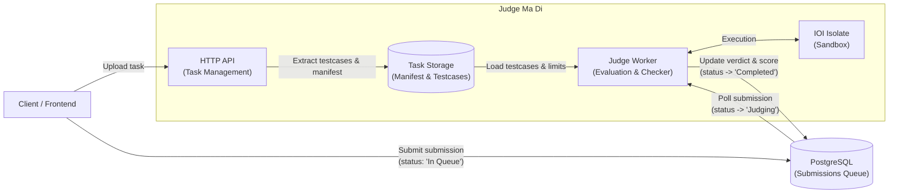

# Online Judge Backend

Judge Ma Di (จัดมาดิ๊)

## Features

- **EDA Queue Polling**: Concurrency-safe, distributed FIFO worker queue powered by PostgreSQL `FOR UPDATE SKIP LOCKED`.
- **Isolated Sandboxed Judging**: Linux cgroups v2 resource isolation.
- **Simple File Storage**: Simple file storage for admin task management.

## Supported Languages

* **C++** (`cpp`): G++ (`--std=c++17 -O2`)
* **C** (`c`): GCC (`--std=c11 -O2`)
* **Python** (`python`): Python 3 (bytecode syntax check + execution)

Extensible via the [`Language`](src/judge/languages/mod.rs) trait adapter system.

# Stack

- Rust
- Axum (Rust API Framework)
- IOI Isolate (Sandbox Environment)
- PostgreSQL (Database)

# Architecture



Binaries:
- **`judge-ma-di`**: Combined monolith (API + Worker).
- **`judge-api`**: Standalone HTTP REST API for task management.
- **`judge-worker`**: Standalone worker polling Postgres and running judge evaluations.

### [:link:Setup (with frontend)](https://gist.github.com/chawinkn/f1c7dae8bc4b0b8f489d0f775c715bcd)

- Docker (Containerization)

## With Docker

Setup the services environment in `compose.yml`:

```bash
$ docker compose -f compose.yml up -d
```

## Without Docker

### Setup env

```bash
$ cp .env.example .env
$ vim .env
# Export environment variables into your shell (POSTGRES_URL is required)
$ set -a && source .env && set +a
```

### Install isolate and testlib

See [docs/scripts.md](docs/scripts.md) for reference documentation on each utility script.

```bash
$ bash scripts/setup.sh
```

### Start

```bash
$ cargo run                         # Monolith (API + Worker)
$ cargo run --bin judge-api         # API Only (port 5000)
$ cargo run --bin judge-worker      # Worker Only
```

### Environment & Observability

- **`APP_ENV=production`**: Structured single-line JSON logs with `severity` field (`DEBUG`, `INFO`, `WARNING`, `ERROR`). 
- **`APP_ENV=development`** (default): Human-readable terminal output.
- **`RUST_LOG`**: Optional override for custom tracing filters (e.g. `RUST_LOG=trace`).

### Git hooks

Runs `cargo fmt` + `cargo clippy` on commit. One-time setup per clone:

```bash
$ git config core.hooksPath .githooks
```

### Testing

```bash
$ cargo test                        # Unit tests
$ cargo test --features integration # Int tests (requires Isolate + Postgres)
```

## Documentation

- [docs/languages.md](docs/languages.md): Guide for adding new languages and custom execution adapters via the `Language` trait.
- [docs/tasks.md](docs/tasks.md): Task directory structure, `manifest.json` specification, and full examples (`a_plus_b`, subtasks).
- [docs/architecture.md](docs/architecture.md): Architecture overview, evaluation lifecycle flow, and design rationale.
- [docs/scaling.md](docs/scaling.md): Horizontal worker scaling, role separation, and cloud deployment guide.
- [docs/scripts.md](docs/scripts.md): Reference for provisioning, checker compilation, and database setup scripts.
- [docs/openapi.yaml](docs/openapi.yaml): Full OpenAPI 3.0 REST API specification.
