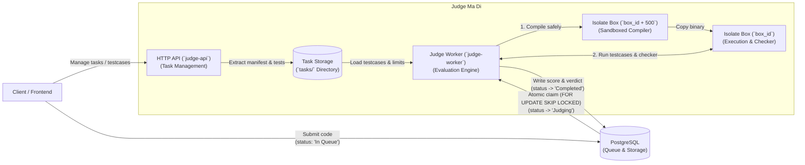
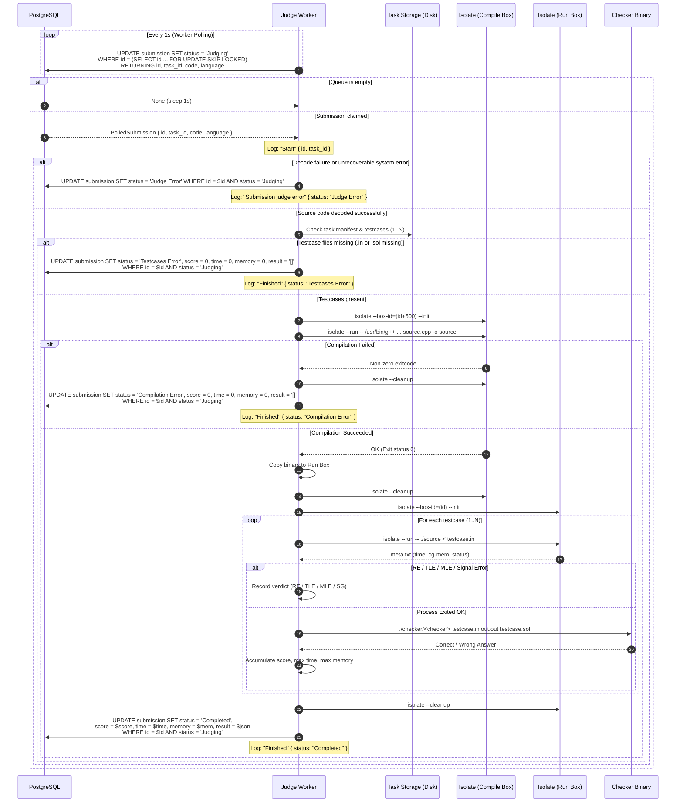

# System Architecture & Design Decisions

This document outlines the architecture of **Judge Ma Di** and the engineering rationale behind each design choice.

---

## 1. System Overview



### Core Components
* **API (`judge-api`)**: Axum HTTP service handling task uploads, manifest queries, statement downloads, and healthchecks.
* **Worker (`judge-worker`)**: Background service polling PostgreSQL, managing Isolate sandboxes, and evaluating submissions.
* **Database (`PostgreSQL 17`)**: Single source of truth for problem metadata, submissions, and queue dispatch.
* **Task Storage**: Local directory (`tasks/<task_id>/`) containing manifests, testcase pairs (`.in`/`.sol`), and checker binaries.
* **Sandbox (`IOI Isolate`)**: Linux cgroups v2 isolation restricting CPU time, memory, wall time, processes, and syscalls.

---

## 2. Submission Polling & Evaluation Lifecycle Flow



---

## 3. Engineering Decisions & Rationale

### A. PostgreSQL Queue over Redis / RabbitMQ (Transactional Outbox Pattern)
* **Eliminates the Dual-Write Problem**: Inserting the submission and queueing it happen in a single atomic database transaction. If you use Postgres + Redis, one write can succeed while the other fails (e.g. database insert succeeds, but Redis publish fails -> submission is lost forever).
* **Table-as-Queue**: The `submission` table serves as both the active queue (`status = 'In Queue'`) and the permanent audit log (`status = 'Completed'`).
* **Atomic worker claim via `FOR UPDATE SKIP LOCKED`**: Native row-level locking ensures N concurrent workers claim distinct jobs without blocking or race conditions:
  ```sql
  UPDATE submission SET status = 'Judging'
  WHERE id = (
      SELECT id FROM submission
      WHERE status = 'In Queue'
      ORDER BY submitted_at ASC, id ASC
      LIMIT 1
      FOR UPDATE SKIP LOCKED
  )
  RETURNING id, task_id, code, language;
  ```
* **Fewer moving parts**: No need to host, monitor, serialize for, or pay for Redis, RabbitMQ, or SQS.
* **Crash recovery**: If a worker crashes mid-evaluation, the row stays in `status = 'Judging'` and can be recovered or requeued cleanly.

#### Database Schema & Contracts

The database uses PostgreSQL 17 with two core tables defined in `scripts/init.sql`:

1. **`task` Table** (Problem Registry):
   * `id` (`TEXT PRIMARY KEY`): Unique task identifier (e.g. `'a_plus_b'`, `'0'`).
   * `title` (`TEXT NOT NULL DEFAULT ''`): Problem display title.
   * `full_score` (`INTEGER NOT NULL DEFAULT 100`): Maximum points achievable.
   * `private` (`BOOLEAN NOT NULL DEFAULT FALSE`): Visibility flag for contests/drafts.

2. **`submission` Table** (Queue & Audit Log):
   * `id` (`SERIAL PRIMARY KEY`): Auto-incrementing submission identifier.
   * `task_id` (`TEXT NOT NULL`): Foreign task identifier referencing task assets in `tasks/<task_id>/`.
   * `status` (`TEXT NOT NULL DEFAULT 'In Queue'`): Submission lifecycle state:
     * `'In Queue'`: Waiting for worker pickup.
     * `'Judging'`: Currently running inside an Isolate sandbox.
     * `'Completed'`: Evaluated successfully (verdicts recorded in `result`).
     * `'Compilation Error'`: Sandboxed compiler returned a non-zero exit code.
     * `'Testcases Error'`: Missing `.in` or `.sol` files on disk.
     * `'Judge Error'`: Unrecoverable decode or system failure.
   * `submitted_at` (`TIMESTAMPTZ DEFAULT NOW()`): Timestamp of submission receipt.
   * `time` (`INTEGER NOT NULL DEFAULT 0`): Max runtime across testcases in **milliseconds (ms)**.
   * `memory` (`INTEGER NOT NULL DEFAULT 0`): Max memory across testcases in **kilobytes (KB)**.
   * `code` (`BYTEA NOT NULL`): **Brotli-compressed JSON** source code (decompressed into UTF-8 JSON string or single-element array; capped at 10 MB uncompressed to prevent Brotli decompression bombs).
   * `score` (`INTEGER NOT NULL DEFAULT 0`): Points earned out of `full_score`.
   * `result` (`JSONB NOT NULL DEFAULT '[]'::jsonb`): Array of per-testcase evaluation results:
     ```json
     [
       {
         "status": "Accepted",
         "test_index": 1,
         "subtask_index": 0,
         "score": 10,
         "time": 0.005,
         "memory": 1248
       }
     ]
     ```
   * `language` (`TEXT NOT NULL`): Language adapter key (`"cpp"`, `"c"`, `"python"`).
   * `private` (`BOOLEAN NOT NULL DEFAULT FALSE`): Contest/private submission visibility flag.

3. **`idx_submission_queue` Partial Index**:
   ```sql
   CREATE INDEX IF NOT EXISTS idx_submission_queue
   ON submission (submitted_at ASC, id ASC)
   WHERE status = 'In Queue';
   ```
   Ensures the worker's FIFO queue polling query executes as an index scan with zero disk sort overhead even under high historical table volume.

### B. Single Docker Image with Multi-Binary Target
* **One image to build**: Generates all three binaries (`judge-ma-di`, `judge-api`, `judge-worker`) in a single multi-stage build.
* **Zero version drift**: API and Worker always run the exact same dependencies, system compilers, and Isolate binary.
* **Fast deployment switch**: Default command runs the monolith (`judge-ma-di`). Setting `command: ["./judge-api"]` or `command: ["./judge-worker"]` switches roles without rebuilding.

### C. Dedicated Isolate Sandbox for Compilation
* **The issue**: `g++` compilation peaks at ~75 MB of memory. Linux cgroup v2 tracks the lifetime peak memory of that cgroup slice (`memory.peak`).
* **Why it matters**: Compiling in the execution box inflates `memory.peak` to ~75 MB. When the student binary runs, Isolate checks the cgroup peak and triggers a false Memory Limit Exceeded (MLE) on tasks with a smaller limit (e.g. 16 MB).
* **The fix**: We compile in a temporary sandbox (`box_id + 500`), copy the output executable to a clean sandbox (`box_id = submission_id % 500`), and run testcases. This guarantees box IDs stay strictly within Isolate's valid `0..=999` range while preventing ID collisions. Testcase memory reflects only the user binary (~1 MB for C++).

### D. Local Filesystem Storage over S3 / MinIO
* **Low-latency I/O**: Isolate runners and checkers read testcases directly from local disk. Zero network hop during judging.
* **Simple multi-worker sharing**: Multi-worker setups share a single volume mount (Docker volume, NFS, AWS EFS, or GCP Filestore) at `tasks/`.
* **Right for our scale**: No S3 bucket keys to manage, no cloud storage API costs, and works 100% offline.

### E. Structured Production Logs & Local Text Logs
* **GCP Cloud Logging integration**: In production (`APP_ENV=production`), emits single-line JSON with `"severity"` (`DEBUG`, `INFO`, `WARNING`, `ERROR`) so Cloud Logging automatically colors and filters logs.
* **Zero polling spam**: Silences `tokio_postgres` 1-second query logs in production, preventing log pollution.
* **Lifecycle events only**: Emits concise `Start` and `Finished` logs with `submission_id`, `task_id`, and `status`. Detailed testcase breakdowns and metrics remain stored in the database.
* **Local DX**: In development (`APP_ENV=development`), outputs human-readable colored text with full debug logs.

### F. Sandbox Security & Fault Tolerance
* **RAII Sandbox Resource Cleanup**: `Isolate` implements `Drop` to guarantee sandbox directories and cgroups are unconditionally cleaned up even on mid-run errors or panics.
* **Safe Sandbox Metadata Placement**: Execution metadata (`meta.txt`) is stored outside the untrusted `box/` directory in the system temp directory (`/tmp/isolate_meta_<box_id>.txt`), preventing untrusted code from tampering with or creating directories colliding with `meta.txt`, while enabling non-root runner and test execution.
* **Bounded Checker Execution**: Checkers are wrapped with a 10-second timeout (`/usr/bin/timeout 10`) on the host to prevent hanging or malicious testlib checkers from locking worker threads.
* **Resilient Worker Polling**: Database connection pool dropouts and transient query errors are caught and retried with exponential backoff rather than terminating the process with `exit(1)`.
* **Non-Blocking Runtime Offloading**: Synchronous judging execution ([`runner::run`](file:///mnt/c/Users/sitti/judge-ma-di/src/judge/runner.rs)) is offloaded via `tokio::task::spawn_blocking`, ensuring subprocess calls and disk I/O never starve Tokio async threads or stall Axum HTTP endpoints.


