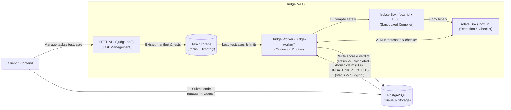
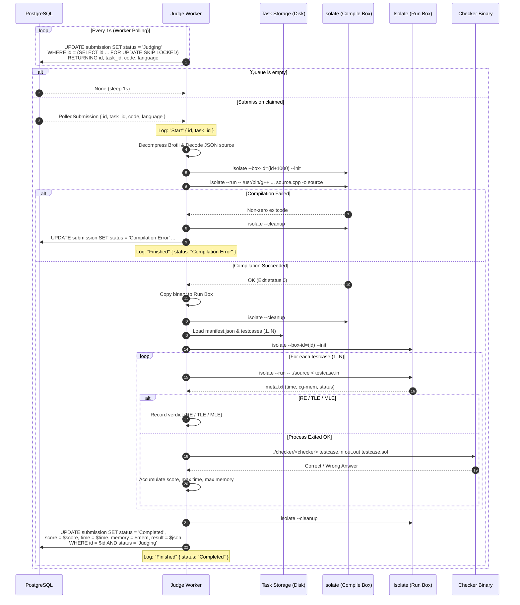

# System Architecture & Design Decisions

This document outlines the architecture of **Judge Ma Di** and the engineering rationale behind each design choice.

---

## 1. System Overview

### Core Components
* **API (`judge-api`)**: Axum HTTP service handling task uploads, manifest queries, statement downloads, and healthchecks.
* **Worker (`judge-worker`)**: Background service polling PostgreSQL, managing Isolate sandboxes, and evaluating submissions.
* **Database (`PostgreSQL 17`)**: Single source of truth for problem metadata, submissions, and queue dispatch.
* **Task Storage**: Local directory (`tasks/<task_id>/`) containing manifests, testcase pairs (`.in`/`.sol`), and checker binaries.
* **Sandbox (`IOI Isolate`)**: Linux cgroups v2 isolation restricting CPU time, memory, wall time, processes, and syscalls.

---

## 2. Submission Polling & Evaluation Lifecycle Flow

---

## 3. Engineering Decisions & Rationale

### A. PostgreSQL Queue over Redis / RabbitMQ (Transactional Outbox Pattern)
* **Eliminates the Dual-Write Problem**: Inserting the submission and queueing it happen in a single atomic database transaction. If you use Postgres + Redis, one write can succeed while the other fails (e.g. database insert succeeds, but Redis publish fails -> submission is lost forever).
* **Table-as-Queue**: The `submission` table serves as both the active queue (`status = 'In Queue'`) and the permanent audit log (`status = 'Completed'`).
* **Atomic worker claim via `FOR UPDATE SKIP LOCKED`**: Native row-level locking ensures N concurrent workers claim distinct jobs without blocking or race conditions.
* **Fewer moving parts**: No need to host, monitor, serialize for, or pay for Redis, RabbitMQ, or SQS.
* **Crash recovery**: If a worker crashes mid-evaluation, the row stays in `status = 'Judging'` and can be recovered or requeued cleanly.

### B. Single Docker Image with Multi-Binary Target
* **One image to build**: Generates all three binaries (`judge-ma-di`, `judge-api`, `judge-worker`) in a single multi-stage build.
* **Zero version drift**: API and Worker always run the exact same dependencies, system compilers, and Isolate binary.
* **Fast deployment switch**: Default command runs the monolith (`judge-ma-di`). Setting `command: ["./judge-api"]` or `command: ["./judge-worker"]` switches roles without rebuilding.

### C. Dedicated Isolate Sandbox for Compilation
* **The issue**: `g++` compilation peaks at ~75 MB of memory. Linux cgroup v2 tracks the lifetime peak memory of that cgroup slice (`memory.peak`).
* **Why it matters**: Compiling in the execution box inflates `memory.peak` to ~75 MB. When the student binary runs, Isolate checks the cgroup peak and triggers a false Memory Limit Exceeded (MLE) on tasks with a smaller limit (e.g. 16 MB).
* **The fix**: We compile in a temporary sandbox (`box_id + 1000`), copy the output executable to a clean sandbox (`box_id`), and run testcases. Testcase memory reflects only the user binary (~1 MB for C++).

### D. Local Filesystem Storage over S3 / MinIO
* **Low-latency I/O**: Isolate runners and checkers read testcases directly from local disk. Zero network hop during judging.
* **Simple multi-worker sharing**: Multi-worker setups share a single volume mount (Docker volume, NFS, AWS EFS, or GCP Filestore) at `tasks/`.
* **Right for our scale**: No S3 bucket keys to manage, no cloud storage API costs, and works 100% offline.

### E. Structured Production Logs & Local Text Logs
* **GCP Cloud Logging integration**: In production (`APP_ENV=production`), emits single-line JSON with `"severity"` (`DEBUG`, `INFO`, `WARNING`, `ERROR`) so Cloud Logging automatically colors and filters logs.
* **Zero polling spam**: Silences `tokio_postgres` 1-second query logs in production, preventing log pollution.
* **Lifecycle events only**: Emits concise `Start` and `Finished` logs with `submission_id`, `task_id`, and `status`. Detailed testcase breakdowns and metrics remain stored in the database.
* **Local DX**: In development (`APP_ENV=development`), outputs human-readable colored text with full debug logs.
